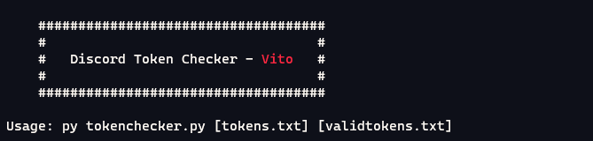
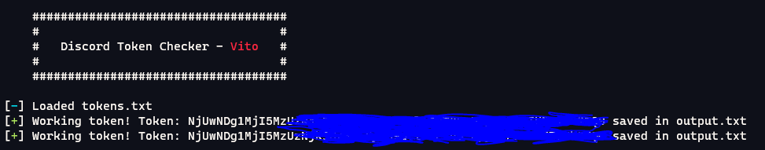

# Token Checker
A real simple fucking discord token checker.

### Showcase

*tokens.txt* is the file that contains the tokens i want to check, *validtokens.txt* is where i want to save all the working tokens. You can of course change on that! :)

Sorry for the cancerous blur just had to do it lol

### requirements
The Token Checker uses *colorama* and *requests* modules.
